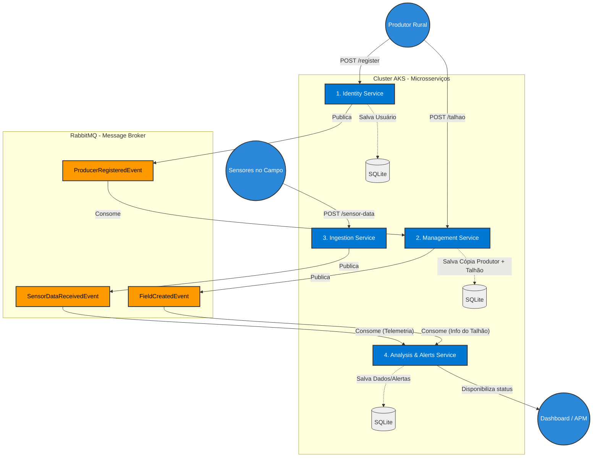

# hackathon-8nett-agrosolutions

A AgroSolutions contratou os alunos do curso 8NETT para realizar a análise do projeto, arquitetura do software e desenvolvimento do MVP desta plataforma inovadora. Projeto FIAP do curso de Arquitetura de Sistemas .NET.

### Estrutura do projeto

Resolvi criar este repositório único (Monorepo) com os 4 microsserviços separados por pastas e utilizando a Arquitetura em Camadas (API, Application, Domain, Infrastructure).

#### Microsserviço de Identidade (Identity Service)
Responsável pelo login e gestão dos produtores rurais.

<details>
<summary>Criação inicial da solution e os projetos respectivos</summary>

```bash
mkdir agro-identity
cd agro-identity

# Criação da Solução e Projetos
dotnet new sln -n AgroSolutions.Identity
dotnet new webapi -n AgroSolutions.Identity.API
dotnet new classlib -n AgroSolutions.Identity.Application
dotnet new classlib -n AgroSolutions.Identity.Domain
dotnet new classlib -n AgroSolutions.Identity.Infrastructure
dotnet new xunit -n AgroSolutions.Identity.Tests

# Adicionando projetos na Solution
dotnet sln add AgroSolutions.Identity.API/AgroSolutions.Identity.API.csproj
dotnet sln add AgroSolutions.Identity.Application/AgroSolutions.Identity.Application.csproj
dotnet sln add AgroSolutions.Identity.Domain/AgroSolutions.Identity.Domain.csproj
dotnet sln add AgroSolutions.Identity.Infrastructure/AgroSolutions.Identity.Infrastructure.csproj
dotnet sln add AgroSolutions.Identity.Tests/AgroSolutions.Identity.Tests.csproj

# Referências de Arquitetura (Repository Pattern)
dotnet add AgroSolutions.Identity.API/AgroSolutions.Identity.API.csproj reference AgroSolutions.Identity.Application/AgroSolutions.Identity.Application.csproj
dotnet add AgroSolutions.Identity.API/AgroSolutions.Identity.API.csproj reference AgroSolutions.Identity.Infrastructure/AgroSolutions.Identity.Infrastructure.csproj

dotnet add AgroSolutions.Identity.Infrastructure/AgroSolutions.Identity.Infrastructure.csproj reference AgroSolutions.Identity.Application/AgroSolutions.Identity.Application.csproj
dotnet add AgroSolutions.Identity.Infrastructure/AgroSolutions.Identity.Infrastructure.csproj reference AgroSolutions.Identity.Domain/AgroSolutions.Identity.Domain.csproj

dotnet add AgroSolutions.Identity.Application/AgroSolutions.Identity.Application.csproj reference AgroSolutions.Identity.Domain/AgroSolutions.Identity.Domain.csproj

dotnet add AgroSolutions.Identity.Tests/AgroSolutions.Identity.Tests.csproj reference AgroSolutions.Identity.Application/AgroSolutions.Identity.Application.csproj
dotnet add AgroSolutions.Identity.Tests/AgroSolutions.Identity.Tests.csproj reference AgroSolutions.Identity.Domain/AgroSolutions.Identity.Domain.csproj

# Pacotes NuGet (SQLite, APM, JWT e MassTransit)
dotnet add AgroSolutions.Identity.Infrastructure package Microsoft.EntityFrameworkCore.Sqlite
dotnet add AgroSolutions.Identity.Infrastructure package Microsoft.EntityFrameworkCore.Design
dotnet add AgroSolutions.Identity.Infrastructure package Microsoft.EntityFrameworkCore.Tools

dotnet add AgroSolutions.Identity.API package Microsoft.AspNetCore.Authentication.JwtBearer
dotnet add AgroSolutions.Identity.API package Microsoft.ApplicationInsights.AspNetCore
dotnet add AgroSolutions.Identity.API package MassTransit.RabbitMQ
dotnet add AgroSolutions.Identity.API package Microsoft.EntityFrameworkCore.Design

cd ..
```
</details>

#### Microsserviço de Gestão (Management Service)
Responsável pelo cadastro de propriedades e talhões.

<details>
	<summary>Criação inicial da solution e os projetos respectivos</summary>

```bash
mkdir agro-management
cd agro-management

# Criação da Solução e Projetos
dotnet new sln -n AgroSolutions.Management
dotnet new webapi -n AgroSolutions.Management.API
dotnet new classlib -n AgroSolutions.Management.Application
dotnet new classlib -n AgroSolutions.Management.Domain
dotnet new classlib -n AgroSolutions.Management.Infrastructure
dotnet new xunit -n AgroSolutions.Management.Tests

# Adicionando projetos na Solution
dotnet sln add AgroSolutions.Management.API/AgroSolutions.Management.API.csproj
dotnet sln add AgroSolutions.Management.Application/AgroSolutions.Management.Application.csproj
dotnet sln add AgroSolutions.Management.Domain/AgroSolutions.Management.Domain.csproj
dotnet sln add AgroSolutions.Management.Infrastructure/AgroSolutions.Management.Infrastructure.csproj
dotnet sln add AgroSolutions.Management.Tests/AgroSolutions.Management.Tests.csproj

# Referências de Arquitetura
dotnet add AgroSolutions.Management.API/AgroSolutions.Management.API.csproj reference AgroSolutions.Management.Application/AgroSolutions.Management.Application.csproj
dotnet add AgroSolutions.Management.API/AgroSolutions.Management.API.csproj reference AgroSolutions.Management.Infrastructure/AgroSolutions.Management.Infrastructure.csproj

dotnet add AgroSolutions.Management.Infrastructure/AgroSolutions.Management.Infrastructure.csproj reference AgroSolutions.Management.Application/AgroSolutions.Management.Application.csproj
dotnet add AgroSolutions.Management.Infrastructure/AgroSolutions.Management.Infrastructure.csproj reference AgroSolutions.Management.Domain/AgroSolutions.Management.Domain.csproj

dotnet add AgroSolutions.Management.Application/AgroSolutions.Management.Application.csproj reference AgroSolutions.Management.Domain/AgroSolutions.Management.Domain.csproj

# Pacotes NuGet
dotnet add AgroSolutions.Management.Infrastructure package Microsoft.EntityFrameworkCore.Sqlite
dotnet add AgroSolutions.Management.Infrastructure package Microsoft.EntityFrameworkCore.Design
dotnet add AgroSolutions.Management.Infrastructure package Microsoft.EntityFrameworkCore.Tools

dotnet add AgroSolutions.Management.API package Microsoft.AspNetCore.Authentication.JwtBearer
dotnet add AgroSolutions.Management.API package Microsoft.ApplicationInsights.AspNetCore
dotnet add AgroSolutions.Management.API package MassTransit.RabbitMQ
dotnet add AgroSolutions.Management.API package Microsoft.EntityFrameworkCore.Design

cd ..
```
</details>

#### Microsserviço de Ingestão (Ingestion Service)
Responsável por receber os dados dos sensores e enviar para a fila do RabbitMQ.

<details>
	<summary>Criação inicial da solution e os projetos respectivos</summary>

```bash
mkdir agro-ingestion
cd agro-ingestion

# Criação da Solução e Projetos
dotnet new sln -n AgroSolutions.Ingestion
dotnet new webapi -n AgroSolutions.Ingestion.API
dotnet new classlib -n AgroSolutions.Ingestion.Application
dotnet new classlib -n AgroSolutions.Ingestion.Domain
dotnet new classlib -n AgroSolutions.Ingestion.Infrastructure
dotnet new xunit -n AgroSolutions.Ingestion.Tests

# Adicionando projetos na Solution
dotnet sln add AgroSolutions.Ingestion.API/AgroSolutions.Ingestion.API.csproj
dotnet sln add AgroSolutions.Ingestion.Application/AgroSolutions.Ingestion.Application.csproj
dotnet sln add AgroSolutions.Ingestion.Domain/AgroSolutions.Ingestion.Domain.csproj
dotnet sln add AgroSolutions.Ingestion.Infrastructure/AgroSolutions.Ingestion.Infrastructure.csproj
dotnet sln add AgroSolutions.Ingestion.Tests/AgroSolutions.Ingestion.Tests.csproj

# Referências de Arquitetura
dotnet add AgroSolutions.Ingestion.API/AgroSolutions.Ingestion.API.csproj reference AgroSolutions.Ingestion.Application/AgroSolutions.Ingestion.Application.csproj
dotnet add AgroSolutions.Ingestion.API/AgroSolutions.Ingestion.API.csproj reference AgroSolutions.Ingestion.Infrastructure/AgroSolutions.Ingestion.Infrastructure.csproj

dotnet add AgroSolutions.Ingestion.Infrastructure/AgroSolutions.Ingestion.Infrastructure.csproj reference AgroSolutions.Ingestion.Application/AgroSolutions.Ingestion.Application.csproj
dotnet add AgroSolutions.Ingestion.Infrastructure/AgroSolutions.Ingestion.Infrastructure.csproj reference AgroSolutions.Ingestion.Domain/AgroSolutions.Ingestion.Domain.csproj

dotnet add AgroSolutions.Ingestion.Application/AgroSolutions.Ingestion.Application.csproj reference AgroSolutions.Ingestion.Domain/AgroSolutions.Ingestion.Domain.csproj

# Pacotes NuGet
dotnet add AgroSolutions.Ingestion.Infrastructure package Microsoft.EntityFrameworkCore.Sqlite
dotnet add AgroSolutions.Ingestion.Infrastructure package Microsoft.EntityFrameworkCore.Design
dotnet add AgroSolutions.Ingestion.Infrastructure package Microsoft.EntityFrameworkCore.Tools

dotnet add AgroSolutions.Ingestion.API package Microsoft.AspNetCore.Authentication.JwtBearer
dotnet add AgroSolutions.Ingestion.API package Microsoft.ApplicationInsights.AspNetCore
dotnet add AgroSolutions.Ingestion.API package MassTransit.RabbitMQ
dotnet add AgroSolutions.Ingestion.API package Microsoft.EntityFrameworkCore.Design

cd ..
```
</details>

#### Microsserviço de Análise e Alertas (Alerts Service)
Responsável por ler a fila do RabbitMQ, processar as regras de umidade/temperatura e gerar alertas.

<details>
	<summary>Criação inicial da solution e os projetos respectivos</summary>

```bash
mkdir agro-alerts
cd agro-alerts

# Criação da Solução e Projetos
dotnet new sln -n AgroSolutions.Alerts
dotnet new webapi -n AgroSolutions.Alerts.API
dotnet new classlib -n AgroSolutions.Alerts.Application
dotnet new classlib -n AgroSolutions.Alerts.Domain
dotnet new classlib -n AgroSolutions.Alerts.Infrastructure
dotnet new xunit -n AgroSolutions.Alerts.Tests

# Adicionando projetos na Solution
dotnet sln add AgroSolutions.Alerts.API/AgroSolutions.Alerts.API.csproj
dotnet sln add AgroSolutions.Alerts.Application/AgroSolutions.Alerts.Application.csproj
dotnet sln add AgroSolutions.Alerts.Domain/AgroSolutions.Alerts.Domain.csproj
dotnet sln add AgroSolutions.Alerts.Infrastructure/AgroSolutions.Alerts.Infrastructure.csproj
dotnet sln add AgroSolutions.Alerts.Tests/AgroSolutions.Alerts.Tests.csproj

# Referências de Arquitetura
dotnet add AgroSolutions.Alerts.API/AgroSolutions.Alerts.API.csproj reference AgroSolutions.Alerts.Application/AgroSolutions.Alerts.Application.csproj
dotnet add AgroSolutions.Alerts.API/AgroSolutions.Alerts.API.csproj reference AgroSolutions.Alerts.Infrastructure/AgroSolutions.Alerts.Infrastructure.csproj

dotnet add AgroSolutions.Alerts.Infrastructure/AgroSolutions.Alerts.Infrastructure.csproj reference AgroSolutions.Alerts.Application/AgroSolutions.Alerts.Application.csproj
dotnet add AgroSolutions.Alerts.Infrastructure/AgroSolutions.Alerts.Infrastructure.csproj reference AgroSolutions.Alerts.Domain/AgroSolutions.Alerts.Domain.csproj

dotnet add AgroSolutions.Alerts.Application/AgroSolutions.Alerts.Application.csproj reference AgroSolutions.Alerts.Domain/AgroSolutions.Alerts.Domain.csproj

# Pacotes NuGet
dotnet add AgroSolutions.Alerts.Infrastructure package Microsoft.EntityFrameworkCore.Sqlite
dotnet add AgroSolutions.Alerts.Infrastructure package Microsoft.EntityFrameworkCore.Design
dotnet add AgroSolutions.Alerts.Infrastructure package Microsoft.EntityFrameworkCore.Tools

dotnet add AgroSolutions.Alerts.API package Microsoft.AspNetCore.Authentication.JwtBearer
dotnet add AgroSolutions.Alerts.API package Microsoft.ApplicationInsights.AspNetCore
dotnet add AgroSolutions.Alerts.API package MassTransit.RabbitMQ
dotnet add AgroSolutions.Alerts.API package Microsoft.EntityFrameworkCore.Design

cd ..
```
</details>

#### Biblioteca compartilhada

Isso vai garantir que quem publica e quem consome o evento estão usando exatamente o mesmo "contrato", evitando erros de desserialização no RabbitMQ.

<details>
	<summary>Criação inicial da solution e os projetos respectivos</summary>

```bash
# Na raiz do repositório:
mkdir agro-shared
cd agro-shared

# Cria o projeto classlib
dotnet new classlib -n AgroSolutions.Shared

# Apaga o Class1.cs padrão
rm Class1.cs 
cd ..

# Referencia no Identity
dotnet add agro-identity/AgroSolutions.Identity.Application/AgroSolutions.Identity.Application.csproj reference agro-shared/AgroSolutions.Shared/AgroSolutions.Shared.csproj

# Referencia no Management
dotnet add agro-management/AgroSolutions.Management.Application/AgroSolutions.Management.Application.csproj reference agro-shared/AgroSolutions.Shared/AgroSolutions.Shared.csproj

# Referencia no Ingestion
dotnet add agro-ingestion/AgroSolutions.Ingestion.Application/AgroSolutions.Ingestion.Application.csproj reference agro-shared/AgroSolutions.Shared/AgroSolutions.Shared.csproj

# Referencia no Alerts
dotnet add agro-alerts/AgroSolutions.Alerts.Application/AgroSolutions.Alerts.Application.csproj reference agro-shared/AgroSolutions.Shared/AgroSolutions.Shared.csproj
```
</details>

## Fluxograma da estrutura orientada a eventos



### Vantagens dessa abordagem
- Desacoplamento Real: O Ingestion Service não faz ideia de quem é o Alerts Service. Ele só joga a temperatura na fila e segue a vida (garantindo altíssimo throughput para receber milhares de requisições IoT).

- Consistência Eventual: O Management Service reage à criação de um produtor para guardar os dados essenciais dele localmente, evitando chamadas HTTP síncronas entre APIs que poderiam causar gargalos ou falhas em cascata.

- Responsabilidade Única: Cada serviço faz apenas uma coisa e tem seu próprio banco, seguindo à risca as boas práticas cobradas.


### Pequeno lembrete/disclaimer

Já que usei a abordagem de criar uma lib compartilhada onde cada projeto tem referência a ela, quando eu for rodar esses Dockerfiles no pipeline .yml vou precisar rodar o comando partindo da raiz do repositório, informando o parâmetro -f para apontar o arquivo, assim:

```bash
# Exemplo
docker build . -f agro-identity/Dockerfile -t nome-da-imagem:tag
```
(O . sinaliza que o contexto é a pasta atual, permitindo que a linha COPY agro-shared/ dos Dockerfiles funcione perfeitamente).